### Atividade Galera do Volei

## Jornada do usuario

✅ 1 - Criar partidas → Jogador passa a ser organizador, partidas pode ter: ( local, numero de vagas, situacao( em adesao, confirmada, cancelada,encerrada ou realizada e em lista de espera) )

✅ 3 - Buscar partidas (opcialmente filtrada)→ jogador pode visualizar a lista de partidas (de forma opcialmente filtrada: data, local ou em adesao) e entrar

✅ 4 - Criar jogador → personalizar perfil (nome, categoria, sexo e data de nascimento)

✅ 5 - Visualização de Perfil → visualizar o perfil do jogador antes de permiti-lo entrar na partida

✅ 6 - Solicitação de Participação → jogador pode pedir solicitacao para entrar na partida, enviando pedido ao organizador

✅ 7 - Lista de solicitacao → organizador pode visualizar a lista de pedidos da partida criada

✅ 8 - Lista de participantes de uma partida → jogador ou organizador pode visualizar participantes

✅ 9 - Cancelar/Aceitar Solicitacao → organizador pode aceitar ou recusar solicitacoes da partida

✅ 10 - Atualizar Partida → organizador pode mudar os dados da partida existente

✅ 11 - Jogador pode desistir da partida

## API DOG Designer

[✨ Link do API Dog](moqmhgh3ko.apidog.io)

## Prints dos Endpoints (Insomnia)

### POST /jogadores

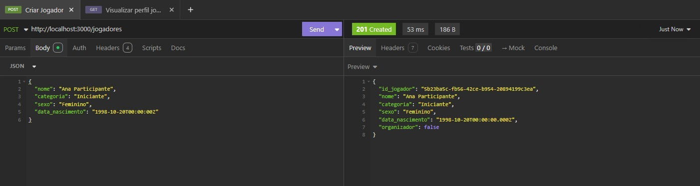

### POST /partidas

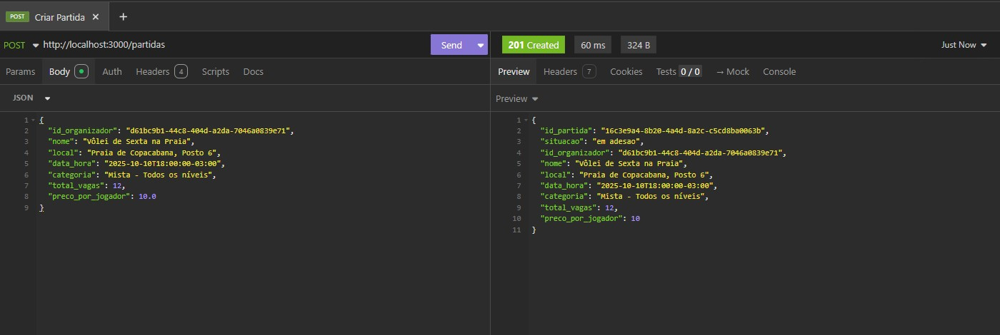

### GET /partidas

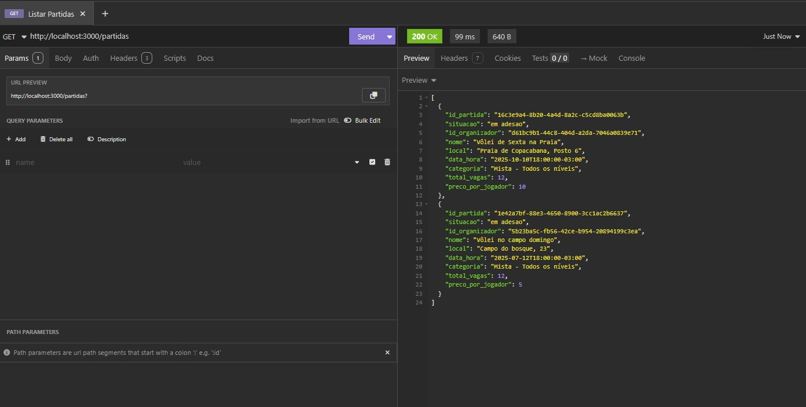

### GET /partidas?filtros

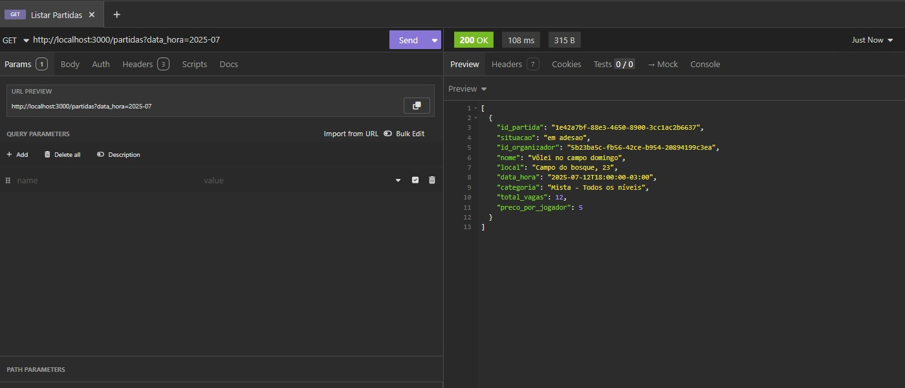

### GET /jogadores/{id_jogador}

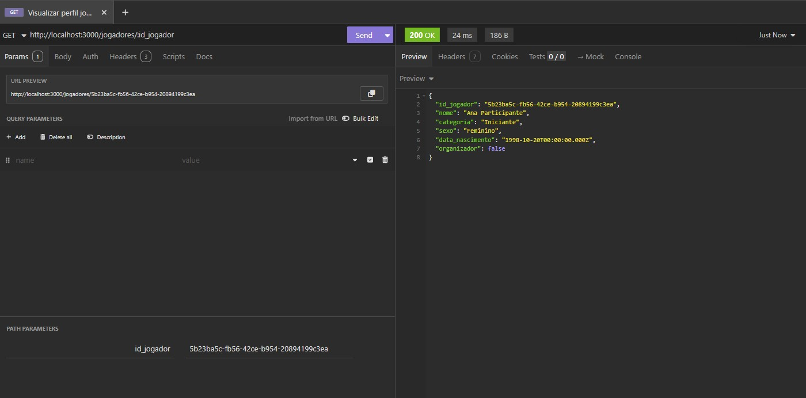

### POST /partidas/{id_partida}/solicitacoes

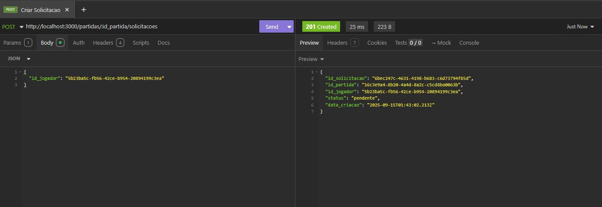

### GET /partidas/{id_partida}/solicitacoes

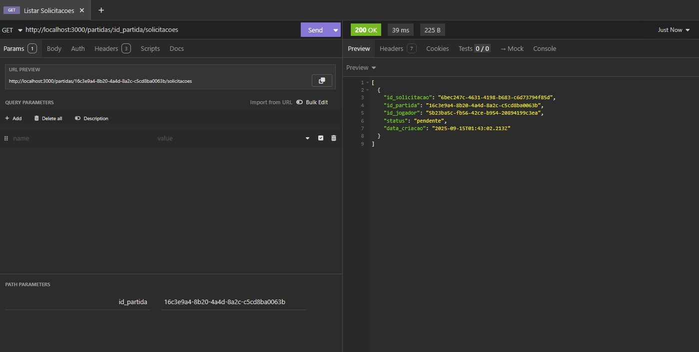

### PATCH /partidas/{id_partida}/solicitacoes/{id_solicitacao} (Aceitar)

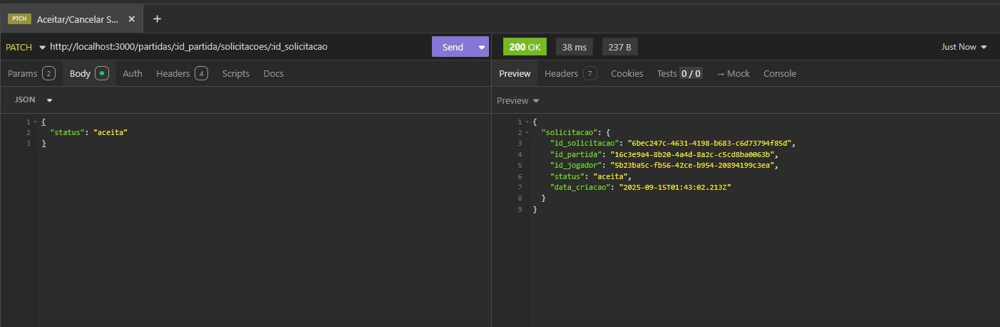

### GET /partidas/{id_partida}/participantes

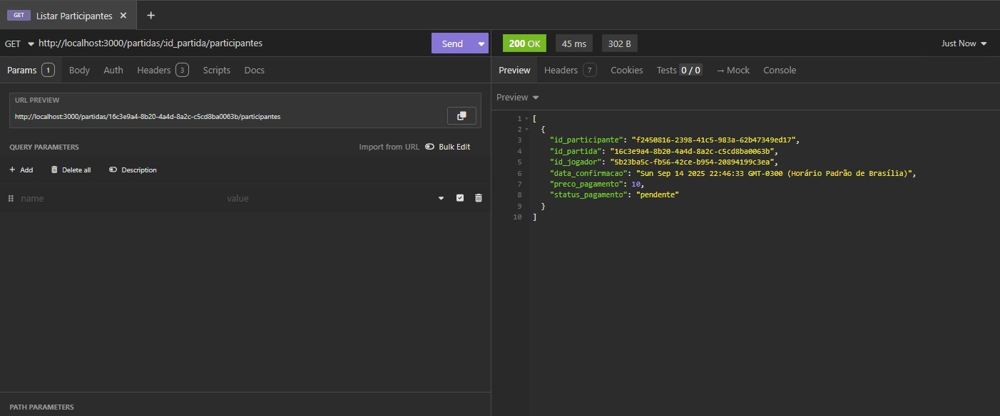

### PATCH /partidas/{id_partida}

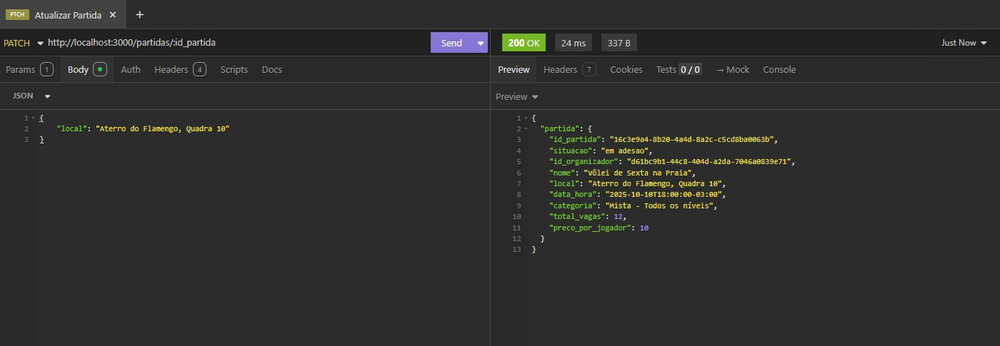

### DELETE /partidas/{id_partida}/participantes/{id_jogador}

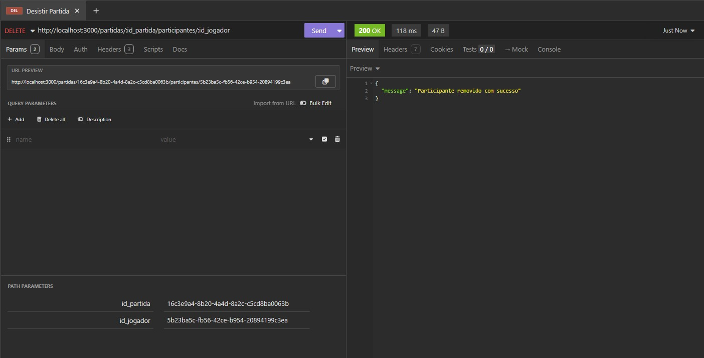

## Violações SOLID do Projeto Anterior vs Melhorias Implementadas

### **Problemas do Projeto Anterior:**
- **S (Single Responsibility)**: Controllers misturavam lógica de negócio com tratamento HTTP
- **O (Open/Closed)**: Código rígido, difícil de estender sem modificar classes existentes  
- **D (Dependency Inversion)**: Dependências diretas entre camadas, acoplamento forte

### ✅ **Melhorias na Nova Versão:**

#### **Single Responsibility Principle (SRP)**
- **Controllers**: Apenas recebem requests HTTP e enviam responses
- **Services**: Exclusivamente para regras de negócio e validações
- **Middlewares**: Responsabilidades específicas (auth, logs, tratamento de erros)

#### **Open/Closed Principle (OCP)**
- **Arquitetura em camadas**: Facilita extensão de funcionalidades
- **Middlewares modulares**: Novos middlewares podem ser adicionados sem modificar código existente
- **Services independentes**: Novas regras de negócio podem ser implementadas sem afetar outras

#### **Dependency Inversion Principle (DIP)**  
- **Injeção de Dependência**: Services são injetados nos controllers
- **Desacoplamento**: Controllers não conhecem implementação dos services
- **Instâncias centralizadas**: Services criados em `serviceInstances.ts` para controle único

